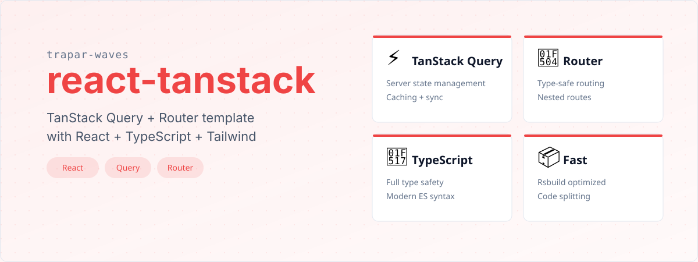

# @trapar-waves/react-tanstack


---

[English](../README.md) | [中文](./README-CN.md) | [Русский язык](./README-RU.md)

> TanStack エコシステムツールを使用したモダンな Web アプリケーション構築のために最適化された本番環境対応の React テンプレート。状態管理、ルーティング、データフェッチング、ビルド最適化などを含む完全な基盤をオールインワンで提供します。




- **モダン React アーキテクチャ：** React 19.x を使用したコンポーネント駆動開発。
- **包括的な状態管理：** [@tanstack/react-query](https://tanstack.com/query) によるサーバー状態管理、キャッシュ、バックグラウンド更新、データ同期。
- **高度なルーティング：** [@tanstack/react-router](https://tanstack.com/router) による型安全なクライアントサイドナビゲーション、ネストされたルートサポート。
- **最適化されたスタイリング：** [Tailwind CSS](https://tailwindcss.com/) によるユーティリティファーストのスタイリング、最小限の設定。
- **型安全性：** コードベース全体にわたる完全な TypeScript 統合。
- **パフォーマンス最適化：** 組み込みのコード分割と遅延読み込み；Rsbuild による最適化されたバンドルサイズ。
- **開発者エクスペリエンス：** 開発中の高速リフレッシュ。
- **CI/CD 準備済み：** 自動テストとリリースのための GitHub Actions ワークフロー。
- **国際化：** 多言語サポートのための構造。
- **本番環境対応：** 最適化されたビルドプロセスとベストプラクティスの実装。


- **フレームワーク：** React 19.x
- **型システム：** TypeScript 5.x
- **状態管理：** `@tanstack/react-query`
- **ルーティング：** `@tanstack/react-router`
- **スタイリング：** Tailwind CSS
- **ビルドツール：** Rsbuild
- **リンティング：** ESLint（`@antfu/eslint-config`）
- **パッケージマネージャー：** pnpm

依存関係の完全なリストは [package.json](../package.json) を参照してください。


### 前提条件

- Node.js（>= 18.x 推奨）
- パッケージマネージャー（npm、yarn、または pnpm）

### インストール

1. テンプレートを使用して新しいプロジェクトを作成：

   ```bash
   pnpm create trapar-waves
   ```

2. プロジェクトディレクトリに移動し、依存関係をインストール：

   ```bash
   pnpm install
   ```

3. 開発サーバーを起動：

   ```bash
   pnpm dev
   ```


```
├── public/             # 静的アセット
├── src/                # ソースコード
│   ├── routes/         # ファイルベースのルート定義
│   │   └── __root.tsx  # ルートレイアウトコンポーネント
│   ├── global.css      # グローバルスタイルと Tailwind インポート
│   ├── index.tsx       # エントリーポイント
│   ├── router.ts       # ルーター設定
│   ├── routeTree.gen.ts # 自動生成されたルートツリー
│   └── env.d.ts        # 環境型宣言
├── rsbuild.config.ts   # Rsbuild 設定
├── tsconfig.json       # TypeScript 設定
├── eslint.config.js    # ESLint 設定
└── package.json        # プロジェクトの依存関係とスクリプト
```


コントリビュートを歓迎します！以下の手順に従ってコントリビュートしてください：

1. リポジトリをフォーク
2. 機能ブランチを作成（`git checkout -b feature/amazing-feature`）
3. 変更をコミット（`git commit -m 'Add some amazing feature'`）
4. ブランチにプッシュ（`git push origin feature/amazing-feature`）
5. Pull Request を作成


MIT License © 2025 Trapar Waves

## 👤 作者

- **Rikka：** [admin@rikka.cc](mailto:admin@rikka.cc)
- **GitHub プロフィール：** [Muromi-Rikka](https://github.com/Muromi-Rikka)

## 🔗 リンク

- **リポジトリ：** [https://github.com/Trapar-waves/react-tanstack](https://github.com/Trapar-waves/react-tanstack)
- **Issues：** [https://github.com/Trapar-waves/react-tanstack/issues](https://github.com/Trapar-waves/react-tanstack/issues)
